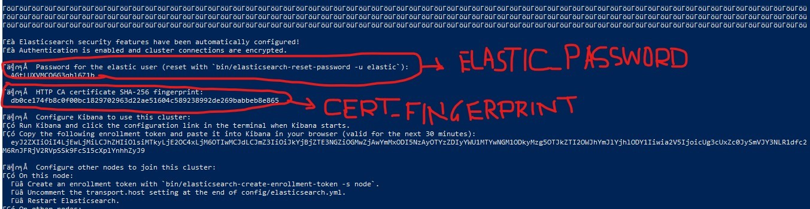

# BERTSemanticSearch Project

"BERT-Based Embeddings for Semantic Search" is a natural language processing (NLP) project that harnesses the power of BERT (Bidirectional Encoder Representations from Transformers) to enhance the performance of semantic search systems. This project is designed to improve the accuracy, relevance, and efficiency of search results by utilizing BERT's deep contextual embeddings and semantic understanding of natural language.

**Project Description:**

The "BERT-Based Embeddings for Semantic Search" project aims to enhance the capabilities of search engines and information retrieval systems by integrating BERT-based embeddings. This project's key features and goals include:

1. **BERT Integration:** BERT, a state-of-the-art pre-trained NLP model, is integrated into the project's search infrastructure. BERT's bidirectional context-aware embeddings enable a deeper understanding of text and user queries.

2. **Semantic Search:** The project focuses on semantic search, which goes beyond traditional keyword-based search. It aims to understand the intent, context, and meaning behind user queries and the documents being searched.

3. **Embedding Generation:** BERT-based embeddings are generated for documents and search queries. These embeddings capture the semantic content of text and enable more accurate matching of documents to user queries.

4. **Semantic Matching:** The system utilizes BERT embeddings to perform semantic matching between queries and documents. This allows for a more precise and context-aware ranking of search results.

5. **Multimodal Support:** In addition to text-based semantic search, the project may explore support for multimodal data, including text, images, and other media types, to enhance the search experience.

6. **Relevance Ranking:** Search results are ranked based on their semantic relevance to the user's query. Documents that closely align with the user's intent are presented at the top of the search results.

7. **User Personalization:** The system may incorporate user behavior and feedback to personalize search results over time, improving the user experience.

8. **Scalability and Performance:** The project focuses on optimizing the efficiency and scalability of semantic search, making it suitable for large-scale applications.

 

## Installation and Usage

To install this project on windows, follow these steps:

1. Clone the repository: `git clone https://github.com/sandipmore060622/BERTSemanticSearch.git` on C drive

2. Download `elasticsearch-8.10.3-windows-x86_64.zip` from 
[elasticsearch](https://artifacts.elastic.co/downloads/elasticsearch/elasticsearch-8.10.3-windows-x86_64.zip)
 and copy it into `BERTSemanticSearch` folder.

3. Open power shell as administrator and Navigate to the project directory: `cd C:\BERTSemanticSearch`

4. Run : `Expand-Archive -Path ".\elasticsearch-8.10.3-windows-x86_64.zip" -DestinationPath ".\elasticsearch-8.10.3"`

5. Run : `cd ".\elasticsearch-8.10.3\elasticsearch-8.10.3"`

6. Run : `.\bin\elasticsearch.bat`

7. Note ELASTIC_PASSWORD and CERT_FINGERPRINT as per following image (observe output from above code run) and replace them in indexData.py and searchApp.py.

8. Run : `pip install -r requirements.txt`
 

9. Run : `python indexData.py`

10. Run : `python searchApp.py`

11. Run : `streamlit run searchApp.py`

12. Open your web browser and go to `http://localhost:8501/`

## License

This project is licensed under the MIT License - see the [LICENSE](LICENSE) file for details.
